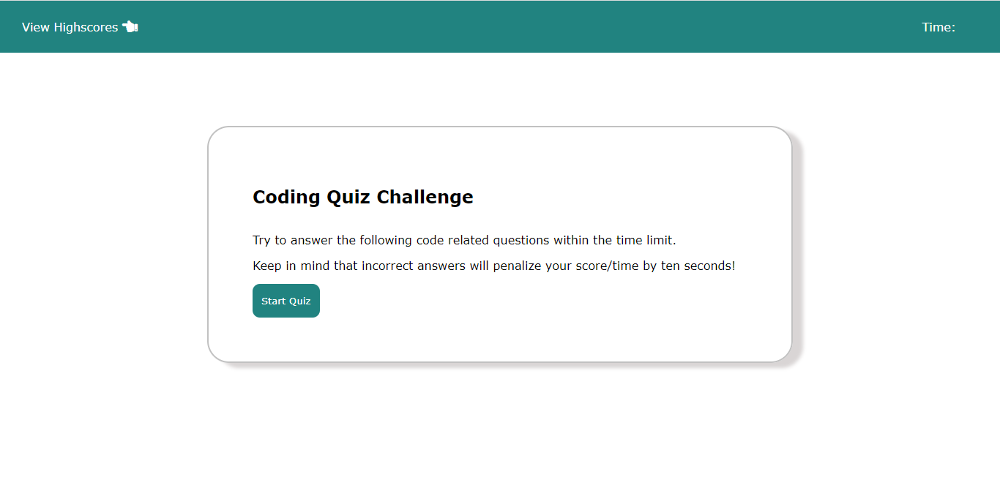
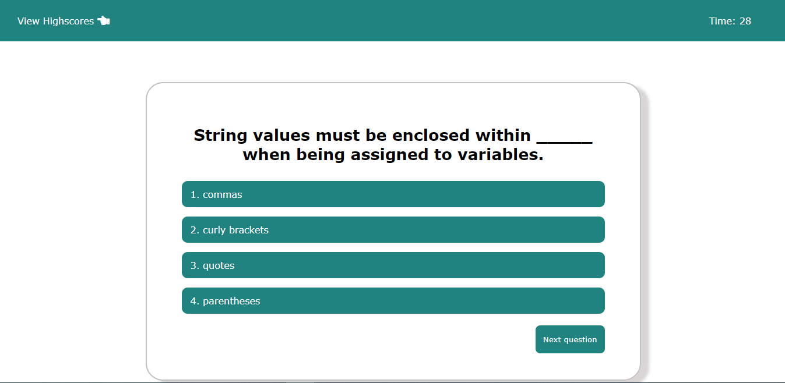

# Codedamn Projects - Quiz App

## Hello developer!

This is one of the many projects available on [codedamn](https://codedamn.com/projects) to reinforce your learning by building. If you want to become a frontend developer and learn by practicing, feel free to attempt this challenge. Feel free to check out the codedamn [frontend web developer learning path](https://codedamn.com/learning-paths) to learn more about how to become an awesome frontend developer.

We decided to attempt this project. The project has four(4) pages in all: 
* The Start Page 
* The Question page 
* The All-done Page and 
* The Highscore Page.

You can read about our experience [here](https://kamet.hashnode.dev/quiz-app)

## :page_facing_up: Table of contents

* [:zap: Quiz App](#zap-quiz-app)
	* [:camera: Screenshots](#camera-screenshots)
	* [:signal_strength: Technologies](#signal_strength-technologies)
    * [:cool: Live-Solution](#cool-live-solution)
	* [:envelope: Contact](#envelope-contact)
    * [:pen: Contributors](#pen-contributors)

## :camera: Screenshots

## :signal_strength: Technologies

* [HTML](https://html.com/) for markup.
* [CSS](https://developer.mozilla.org/en-US/docs/Web/CSS) for styling.
* [Javascript](https://www.javascript.com/) for adding functionalities and making it interactive.
* [Netlify](https://www.netlify.com/) for hosting the project.

## :cool: Live-Solution

* Here is the [Link](https://quiz-app-204.netlify.app/) to the live solution of the clone.

## :envelope: Contact

* Repo created by [Moyinoluwa](https://github.com/moyinoluwa-10/), email: moyinadelowo@gmail.com

## :pen: Contributors

* [Moyinoluwa](https://github.com/moyinoluwa-10/)
* [Tobechukwu](https://github.com/TOBAE/)
* [Ebuka](https://github.com/tzfocus7/)
* [Mardiyyah](https://github.com/Mardie328/)
* [Ayotoke](https://github.com/tokebillions/)
* [Victor](https://github.com/chuka00/)
* [Julius](https://github.com/MacJulius48/)
* [Tobi](https://github.com/Toby48-K/)
